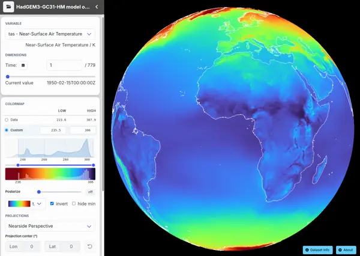

# gridlook

This is a fork of [GridLook](https://github.com/d70-t/gridlook) is a WebGL-based viewer for cloud-hosted Zarr datasets. You can view any **CORS-enabled**, public Zarr dataset with GridLook. I have modified it to support Zarr v3 (better), Icechunk stores, and some number formating that it didn't support out of box. I also added a GitHub Action to server the gridlook viewer on GitHub Pages.



## Try out my fork:

https://eeholmes.github.io/gridlook.

## Try on your own Zarr or Icechunk store:

Put `icechunk+` in front of URI for icechunk stores.

```
https://gridlook.pages.dev/#<STORE_URI>
```
If your S3 bucket url looks like this
```
s3://dynamical-noaa-gefs/noaa-gefs-forecast-35-day/v0.2.0.icechunk/
```
The URI is 
```
https://dynamical-noaa-gefs.s3.amazonaws.com/noaa-gefs-forecast-35-day/v0.2.0.icechunk/
```
If the data are on Source Coop, the url looks like this
```
https://data.source.coop/bkr/gfs/gfs.icechunk
```

Gridlook can also load catalog JSON files that list multiple datasets. The catalog format and deployment options are documented in [docs/catalogs.md](docs/catalogs.md). A guide to the viewer keyboard, mouse, and touch interaction is available in [docs/Controls.md](docs/Controls.md).

## Examples

Not all of these work. This is for testing and coming up with the issues to make it work better.

| Dataset | Format | Comments |
|---|---|---|
| gfs<br>[dataset info](https://dynamical-noaa-gfs.s3.us-west-2.amazonaws.com/noaa-gfs-forecast/v0.2.7.icechunk/) [gridlook viewer](https://eeholmes.github.io/gridlook/#icechunk+https://dynamical-noaa-gfs.s3.us-west-2.amazonaws.com/noaa-gfs-forecast/v0.2.7.icechunk/)<br>URI: `https://dynamical-noaa-gfs.s3.us-west-2.amazonaws.com/noaa-gfs-forecast/v0.2.7.icechunk/` | Icechunk, Zarr v3 | Good, but no categorical data |
| dwd icon eu<br>[dataset info](https://dynamical-dwd-icon-eu.s3.us-west-2.amazonaws.com/dwd-icon-eu-forecast-5-day/v0.2.0.icechunk/) [gridlook viewer](https://eeholmes.github.io/gridlook/#icechunk+https://dynamical-dwd-icon-eu.s3.us-west-2.amazonaws.com/dwd-icon-eu-forecast-5-day/v0.2.0.icechunk/)<br>URI: `https://dynamical-dwd-icon-eu.s3.us-west-2.amazonaws.com/dwd-icon-eu-forecast-5-day/v0.2.0.icechunk/` | Icechunk, Zarr v3 | Good |
| ECMWF AIFS single<br>[dataset info](https://dynamical-ecmwf-aifs-single.s3.us-west-2.amazonaws.com/ecmwf-aifs-single-forecast/v0.1.0.icechunk/) [gridlook viewer](https://eeholmes.github.io/gridlook/#icechunk+https://dynamical-ecmwf-aifs-single.s3.us-west-2.amazonaws.com/ecmwf-aifs-single-forecast/v0.1.0.icechunk/)<br>URI: `https://dynamical-ecmwf-aifs-single.s3.us-west-2.amazonaws.com/ecmwf-aifs-single-forecast/v0.1.0.icechunk/` | Icechunk, Zarr v3 | Pretty nice |
| NOAA HRRR<br>[dataset info](https://dynamical-noaa-hrrr.s3.us-west-2.amazonaws.com/noaa-hrrr-analysis/v0.2.0.icechunk/) [gridlook viewer](https://eeholmes.github.io/gridlook/#icechunk+https://dynamical-noaa-hrrr.s3.us-west-2.amazonaws.com/noaa-hrrr-analysis/v0.2.0.icechunk/)<br>URI: `https://dynamical-noaa-hrrr.s3.us-west-2.amazonaws.com/noaa-hrrr-analysis/v0.2.0.icechunk/` | Icechunk, Zarr v3 | Slow load |
| NOAA MRMS<br>[dataset info](https://dynamical-noaa-mrms.s3.amazonaws.com/noaa-mrms-conus-analysis-hourly/v0.3.0.icechunk/) [gridlook viewer](https://eeholmes.github.io/gridlook/#icechunk+https://dynamical-noaa-mrms.s3.amazonaws.com/noaa-mrms-conus-analysis-hourly/v0.3.0.icechunk/)<br>URI: `https://dynamical-noaa-mrms.s3.amazonaws.com/noaa-mrms-conus-analysis-hourly/v0.3.0.icechunk/` | Icechunk, Zarr v3 | Slow load, categorical data not shown |
| ECMWF AIFS ensemble<br>[dataset info](https://dynamical-ecmwf-aifs-ens.s3.us-west-2.amazonaws.com/ecmwf-aifs-ens-forecast/v0.1.0.icechunk/) [gridlook viewer](https://eeholmes.github.io/gridlook/#icechunk+https://dynamical-ecmwf-aifs-ens.s3.us-west-2.amazonaws.com/ecmwf-aifs-ens-forecast/v0.1.0.icechunk/)<br>URI: `https://dynamical-ecmwf-aifs-ens.s3.us-west-2.amazonaws.com/ecmwf-aifs-ens-forecast/v0.1.0.icechunk/` | Icechunk, Zarr v3 | Slow load, behavior similar to AIFS single |
| ECMWF IFS ensemble<br>[dataset info](https://dynamical-ecmwf-ifs-ens.s3.us-west-2.amazonaws.com/ecmwf-ifs-ens-forecast-15-day-0-25-degree/v0.1.0.icechunk/) [gridlook viewer](https://eeholmes.github.io/gridlook/#icechunk+https://dynamical-ecmwf-ifs-ens.s3.us-west-2.amazonaws.com/ecmwf-ifs-ens-forecast-15-day-0-25-degree/v0.1.0.icechunk/)<br>URI: `https://dynamical-ecmwf-ifs-ens.s3.us-west-2.amazonaws.com/ecmwf-ifs-ens-forecast-15-day-0-25-degree/v0.1.0.icechunk/` | Icechunk, Zarr v3 | Slow load |
| NOAA GEFS analysis<br>[dataset info](https://dynamical-noaa-gefs.s3.us-west-2.amazonaws.com/noaa-gefs-analysis/v0.1.2.icechunk/) [gridlook viewer](https://eeholmes.github.io/gridlook/#icechunk+https://dynamical-noaa-gefs.s3.us-west-2.amazonaws.com/noaa-gefs-analysis/v0.1.2.icechunk/)<br>URI: `https://dynamical-noaa-gefs.s3.us-west-2.amazonaws.com/noaa-gefs-analysis/v0.1.2.icechunk/` | Icechunk, Zarr v3 | Slow load |
| NOAA GEFS 35-day forecast<br>[dataset info](https://dynamical-noaa-gefs.s3.us-west-2.amazonaws.com/noaa-gefs-forecast-35-day/v0.2.0.icechunk/) [gridlook viewer](https://eeholmes.github.io/gridlook/#icechunk+https://dynamical-noaa-gefs.s3.us-west-2.amazonaws.com/noaa-gefs-forecast-35-day/v0.2.0.icechunk/)<br>URI: `https://dynamical-noaa-gefs.s3.us-west-2.amazonaws.com/noaa-gefs-forecast-35-day/v0.2.0.icechunk/` | Icechunk, Zarr v3 | No fetch / fails to load |
| OGS ARCO Ocean<br>[dataset info](https://registry.opendata.aws/ogs-arco-ocean/) [gridlook viewer](https://eeholmes.github.io/gridlook/#zarr+https://ogs-arco-ocean.s3.eu-south-1.amazonaws.com/dataset/tres=1d/res=0p25/levels=10/)<br>URI: `https://ogs-arco-ocean.s3.eu-south-1.amazonaws.com/dataset/tres=1d/res=0p25/levels=10/` | Zarr v2 | Good |
| CHLA-Z<br>[dataset info](https://storage.googleapis.com/nmfs_odp_nwfsc/CB/fish-pace-datasets/chla-z/index.html) [gridlook viewer](https://eeholmes.github.io/gridlook/#zarr+https://storage.googleapis.com/nmfs_odp_nwfsc/CB/fish-pace-datasets/chla-z/zarr)<br>URI: `https://storage.googleapis.com/nmfs_odp_nwfsc/CB/fish-pace-datasets/chla-z/zarr` | Zarr v3 | Loads but very slow and often hangs |
| ISMIP6 AIS<br>[dataset info](https://data.source.coop/englacial/ismip6/icechunk-ais) [gridlook viewer](https://eeholmes.github.io/gridlook/#icechunk+https://data.source.coop/englacial/ismip6/icechunk-ais)<br>URI: `https://data.source.coop/englacial/ismip6/icechunk-ais` | Icechunk, Zarr v3 | Root loads |
| ISMIP6 AIS grouped example<br>[dataset info](https://data.source.coop/englacial/ismip6/icechunk-ais/combined/AWI_PISM1/exp05) [gridlook viewer](https://eeholmes.github.io/gridlook/#icechunk+https://data.source.coop/englacial/ismip6/icechunk-ais/combined/AWI_PISM1/exp05)<br>URI: `https://data.source.coop/englacial/ismip6/icechunk-ais/combined/AWI_PISM1/exp05` | Icechunk, grouped Zarr v3 | Grouped dataset does not load |
| Met Office global wave<br>[dataset info](https://data.source.coop/bkr/metoffice/metoffice_global_wave.icechunk) [gridlook viewer](https://eeholmes.github.io/gridlook/#icechunk+https://data.source.coop/bkr/metoffice/metoffice_global_wave.icechunk)<br>URI: `https://data.source.coop/bkr/metoffice/metoffice_global_wave.icechunk` | Icechunk, Zarr v3 | Good |
| Met Office deterministic 6-hourly<br>[dataset info](https://data.source.coop/bkr/metoffice/metoffice_global_deterministic_10km_6hourly_24hr.icechunk) [gridlook viewer](https://eeholmes.github.io/gridlook/#icechunk+https://data.source.coop/bkr/metoffice/metoffice_global_deterministic_10km_6hourly_24hr.icechunk)<br>URI: `https://data.source.coop/bkr/metoffice/metoffice_global_deterministic_10km_6hourly_24hr.icechunk` | Icechunk, Zarr v3 | Mostly OK |
| GEOS 15 min<br>[dataset info](https://data.source.coop/bkr/geos/geos_15min.icechunk) [gridlook viewer](https://eeholmes.github.io/gridlook/#icechunk+https://data.source.coop/bkr/geos/geos_15min.icechunk)<br>URI: `https://data.source.coop/bkr/geos/geos_15min.icechunk` | Icechunk, Zarr v3 | Loads but values appear incorrect (everything near min) |
| Met Office deterministic 11 hour<br>[dataset info](https://data.source.coop/bkr/metoffice/metoffice_global_deterministic_10km_11hour.icechunk) [gridlook viewer](https://eeholmes.github.io/gridlook/#icechunk+https://data.source.coop/bkr/metoffice/metoffice_global_deterministic_10km_11hour.icechunk)<br>URI: `https://data.source.coop/bkr/metoffice/metoffice_global_deterministic_10km_11hour.icechunk` | Icechunk, Zarr v3 | Data appears incorrect except first timestep |
| Met Office deterministic 10 km<br>[dataset info](https://data.source.coop/bkr/metoffice/metoffice_global_deterministic_10km.icechunk) [gridlook viewer](https://eeholmes.github.io/gridlook/#icechunk+https://data.source.coop/bkr/metoffice/metoffice_global_deterministic_10km.icechunk)<br>URI: `https://data.source.coop/bkr/metoffice/metoffice_global_deterministic_10km.icechunk` | Icechunk, Zarr v3 | Mostly bad |
| AOML 2012<br>[dataset info](https://data.source.coop/bkr/aoml/aoml_2012.icechunk) [gridlook viewer](https://eeholmes.github.io/gridlook/#icechunk+https://data.source.coop/bkr/aoml/aoml_2012.icechunk)<br>URI: `https://data.source.coop/bkr/aoml/aoml_2012.icechunk` | Icechunk, Zarr v3 | Slow load |

## Developers

See `CONTRIBUTING.md` for instructions for running a local version. It is easy.

## CORS & Hosting Notes

To load datasets, you need to ensure [CORS](https://developer.mozilla.org/de/docs/Web/HTTP/Guides/CORS) is enabled on the server. If it is not, you might be out of luck unless you do something like make an icechunk version and host that someplace with CORS enabled (e.g. Source Coop).

